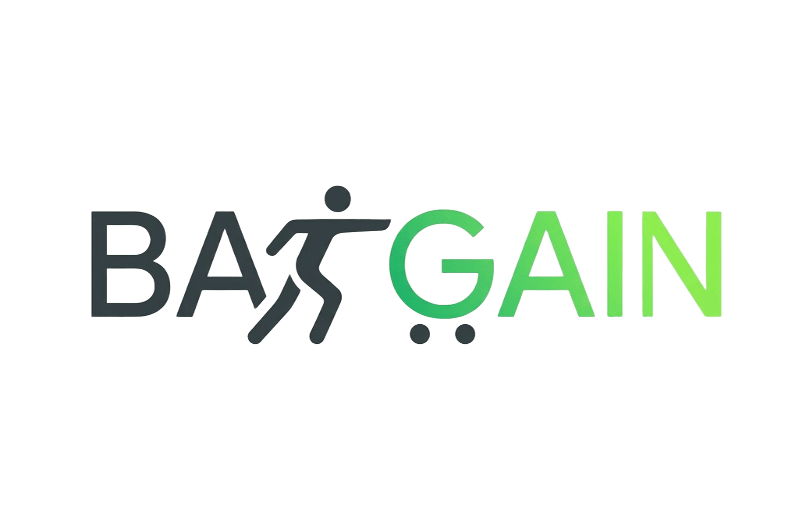

<div align="center">
  
</div>

---

# **BarGAIN** — Compra inteligente, al mejor precio y en el menor tiempo.

[](https://github.com/QHX0329/bargain-tfg/actions/workflows/ci-backend.yml)
[](https://github.com/QHX0329/bargain-tfg/actions/workflows/ci-frontend.yml)
[](LICENSE)

## 📋 Descripción

BarGAIN es una aplicación móvil y web que elimina la ineficiencia en la compra diaria. No solo indica dónde es más barato un producto, sino que calcula la **combinación óptima de supermercados** que ofrece la mejor relación **Precio–Distancia–Tiempo**.

Este proyecto es un **Trabajo Fin de Grado** del Grado en Ingeniería Informática — Ingeniería del Software, Universidad de Sevilla (ETSII).

[](https://qhx0329.github.io/bargain-tfg/dashboard.html)

[](https://qhx0329.github.io/bargain-tfg/docs/diagramas/ui-mockups/index.html)

## 🎯 El Problema

El consumidor se enfrenta a tres barreras:

1. **Asimetría de información**: los precios varían diariamente entre cadenas y no hay una fuente única centralizada.
2. **Coste de oportunidad (Tiempo)**: comparar manualmente ofertas en distintos folletos consume horas.
3. **Ineficiencia logística**: ir a tres supermercados para ahorrar 5€ puede no ser rentable si la ruta no es eficiente.

## 💡 La Solución

BarGAIN actúa como un **orquestador inteligente de la cesta de la compra** mediante cuatro módulos:

| Módulo                  | Descripción                                                                                    |
| ----------------------- | ---------------------------------------------------------------------------------------------- |
| **Ingesta de Precios**  | Web Scraping + Crowdsourcing para precios actualizados de grandes superficies y comercio local |
| **Optimizador de Ruta** | Algoritmo IA que pondera precio, distancia y tiempo para calcular la ruta ideal                |
| **Visión Artificial**   | OCR avanzado para leer listas escritas a mano o tickets anteriores                             |
| **Asistente LLM**       | Interfaz en lenguaje natural para consultas complejas de compra                                |

## 🏗️ Stack Tecnológico

| Capa          | Tecnología                            |
| ------------- | ------------------------------------- |
| Backend       | Django 5 + Django REST Framework      |
| Base de datos | PostgreSQL 16 + PostGIS               |
| Frontend      | React Native (Expo) + React web companion |
| IA/ML         | Claude API + Tesseract (backend) + Tesseract.js (frontend) + OR-Tools |
| Scraping      | Scrapy + Playwright                   |
| Async         | Celery + Redis                        |
| CI/CD         | GitHub Actions                        |
| Infra         | Docker + Docker Compose (dev híbrido) + Render |

## 🚀 Inicio Rápido

### Requisitos previos

- Docker y Docker Compose
- Node.js >=24.10.0 y npm (frontend nativo en host)

Notas importantes:
- El entorno oficial de desarrollo es híbrido: backend en Docker y frontend nativo en host.
- Los comandos de Django (migrate, seed, createsuperuser) deben ejecutarse dentro del contenedor backend.
- Ejecutar Django en local puede funcionar contra PostgreSQL en Docker, pero no es la ruta recomendada
  porque rompe la paridad del entorno y puede introducir diferencias de dependencias (GIS/liberías nativas).

### Instalación

```bash
# Clonar repositorio
git clone https://github.com/QHX0329/bargain-tfg.git
cd bargain-tfg

# Copiar variables de entorno
cp .env.example .env

# Levantar servicios con Docker
make dev

# O manualmente:
docker compose -f docker-compose.dev.yml up -d

# Aplicar migraciones (en el contenedor backend)
make migrate-docker

# Crear superusuario (en el contenedor backend)
make createsuperuser-docker

# Poblar con datos de prueba (en el contenedor backend)
make seed-docker
```

### Desarrollo frontend

```bash
make frontend-install
make frontend
```

## 📁 Estructura del Proyecto

```
bargain-tfg/
├── backend/        # API Django + lógica de negocio
├── frontend/       # App React Native + companion web
├── scraping/       # Spiders de Scrapy (paquete bargain_scraping)
├── docs/           # Documentación y Memoria del TFG
├── .github/        # CI/CD y templates
└── docker-compose.yml
```

## 🧪 Tests

```bash
# Backend
make test-backend

# Frontend
make test-frontend

# Todo
make test
```

## 🤝 Diferenciación del Mercado

| Funcionalidad               | Soysuper/OCU | Tiendeo | Apps Super | **BarGAIN** |
| --------------------------- | :----------: | :-----: | :--------: | :---------: |
| Comparación de Precios      |      ✅      |   ⚠️    |     ❌     |     ✅      |
| Cálculo de Ruta Óptima      |      ❌      |   ❌    |     ❌     |     ✅      |
| Cruce Precio vs. Distancia  |      ❌      |   ❌    |     ❌     |     ✅      |
| OCR de Lista/Ticket         |      ❌      |   ❌    |     ⚠️     |     ✅      |
| Portal PYMES locales        |      ❌      |   ❌    |     ❌     |     ✅      |
| Asistente LLM               |      ❌      |   ❌    |     ⚠️     |     ✅      |
| Recálculo por Stock/Tráfico |      ❌      |   ❌    |     ❌     |     ✅      |

## 📄 Licencia

Este proyecto está bajo la licencia MIT. Ver [LICENSE](LICENSE) para más detalles.

## 👤 Autor

- **Nicolás Parrilla Geniz** — Estudiante de Ingeniería Informática, Universidad de Sevilla
- Tutor: **Juan Vicente Gutiérrez Santacreu**

---

_Proyecto desarrollado como Trabajo Fin de Grado — Escuela Técnica Superior de Ingeniería Informática, Universidad de Sevilla, 2025-2026._
