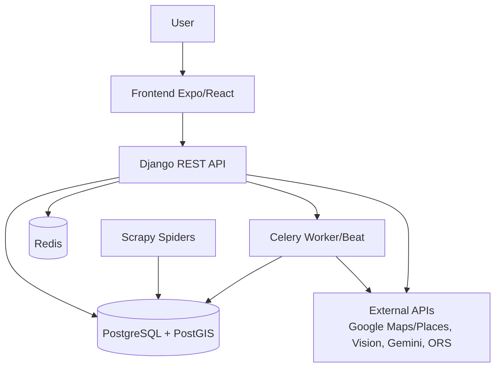

<!-- generated-by: gsd-doc-writer -->
# Architecture Overview

## System Overview
BarGAIN is a hybrid mobile and web system that helps users optimize grocery shopping by combining
price, distance, and time. The main runtime path is:
- React Native (Expo) frontend on host
- Django REST API backend in Docker
- PostgreSQL + PostGIS for data and geospatial queries
- Redis + Celery for asynchronous jobs
- Scrapy project for price ingestion

## Component Diagram


## Data Flow
1. Frontend sends authenticated requests to Django endpoints under `backend/apps/*/views.py`.
2. DRF serializers validate and normalize payloads (`backend/apps/*/serializers.py`).
3. Domain models persist to PostgreSQL/PostGIS (`backend/apps/*/models.py`).
4. Long-running jobs are delegated to Celery tasks (`backend/apps/*/tasks.py`).
5. Optimizer services build route suggestions from list items and store/price data
   (`backend/apps/optimizer/services/solver.py`).
6. Results return to frontend screens and map views.

## Key Abstractions
| Abstraction | Location | Responsibility |
|---|---|---|
| `OptimizationResult` | `backend/apps/optimizer/models.py` | Stores optimization output and route metadata |
| `compute_optimized_route` (solver pipeline) | `backend/apps/optimizer/services/solver.py` | Core multi-criteria route selection logic |
| `Price` | `backend/apps/prices/models.py` | Product price snapshots and freshness data |
| `ShoppingList` / `ShoppingListItem` | `backend/apps/shopping_lists/models.py` | User lists and item-level quantities/state |
| `BusinessProfile` | `backend/apps/business/models.py` | SME profile, verification, and business metadata |
| `Notification` | `backend/apps/notifications/models.py` | User inbox records for app-level alerts |

## Directory Structure Rationale
```text
backend/
  apps/            Django domain apps by bounded context
  config/          Settings, urls, celery wiring
frontend/
  src/             RN app screens/components/state/api clients
  web/             Public web landing and companion pages
scraping/
  bargain_scraping/  Spiders and pipelines for catalog/price ingestion
docs/
  memoria/, decisiones/, diagramas/  TFG and engineering documentation
```

The project is organized by product capability (users, stores, prices, optimizer, OCR, business,
notifications), which keeps API, model, and task code close to each feature boundary.